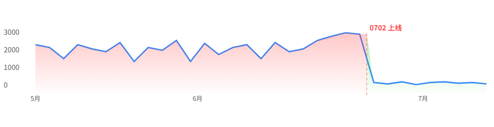
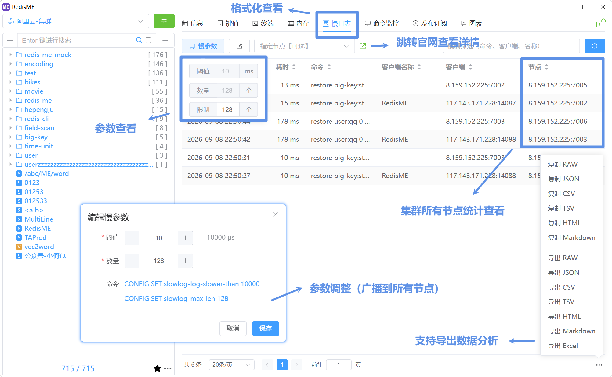

# 慢日志专项治理

## 背景简述

某次生产超时排查中，发现集群里已有不少慢日志。慢命令会阻塞 Redis 主线程，偶发超时若不治理，后续可能波及更多其他应用，因此做专项治理。

## 治理目标

- 生产环境每日慢日志数量降低 **90%+**
- 杜绝再因慢命令出现 Redis 超时

## 治理方案

整体闭环：建基线 → 分类定位 → 排期改造 → 防止复发

### 1. 先定基线，再谈改造

Redis 自带的 `SLOWLOG` 是内存环形缓冲：条数有上限，有新记录时会自动挤掉旧记录，进程重启也会丢。只靠「此刻打开客户端看一眼」，支撑不了归类、排期和效果对比。基线建议先落实下面几项：

| 项         | 做法                                     | 依据                                                                           |
| ---------- | ---------------------------------------- | ------------------------------------------------------------------------------ |
| 慢阈值     | `10ms`（Redis 默认）                     | 与官方默认一致；治理期不必先纠结改阈值，优先处理已超过 10ms 的命令             |
| 保留条数   | 默认 `128` → `512`                       | 排查时 128 已写满，说明不够，但当时不清楚总量；经验调到 512 后未被填满，故沿用 |
| 外部持久化 | 定时拉取集群全部节点，只入库「昨日」记录 | 可当日重复执行、不必 `SLOWLOG RESET`；无按日沉淀则无法对比治理效果             |
| 告警通道   | 按日统计入库条数（全集群合计），超阈通知 | 依赖按日沉淀而非内存快照；阈值可调（本专项当前为 100）                         |

调整 `slowlog-max-len` 时应对齐各节点并 `CONFIG REWRITE`，避免重启回到 128。

### 2. 定位时区分两类根因

基线就绪后，用持久化数据按命令类型、key 前缀等统计占比，优先处理占比高的场景，并与应用负责人对齐改造方案与上线窗口。

**来源怎么定：** 有客户端名称时最直接。缺失时先看 **key 前缀** 大致判断应用，再代码搜索确认；拿不准与负责人核对。容器下 client IP 常是宿主机 IP，不宜当作应用标识。

| 类型           | 典型表现                                               | 处理原则                                     |
| -------------- | ------------------------------------------------------ | -------------------------------------------- |
| 命令使用不规范 | `KEYS`、大 key `DEL`、单次过大的 `HGETALL` / `HMSET`   | 换成安全命令或拆批                           |
| 方案设计缺陷   | 只能靠全库扫才知道有哪些 key；热点大 Hash 被频繁整表拉 | 先确认业务真正需要什么，再改结构或加本地缓存 |

### 3. 常见改造范式

| 现象                            | 改造方向                                             |
| ------------------------------- | ---------------------------------------------------- |
| 高频 `KEYS` + 批量读取          | 若只需 TopN：定时算好写入固定 key；清理类：改 `SCAN` |
| 高频 `HGETALL` / 大范围 `HMGET` | 本地缓存降频，或 `HSCAN` 分批（按体量调 `COUNT`）    |
| 大批量 `HMSET` / `HSET`         | 拆成多批，避免单次命令过大                           |
| 大 key 上的 `DEL`               | 改 `UNLINK`（键立即不可见，内存异步回收）            |

**为什么不直接禁用 `KEYS`**

`rename-command KEYS ""` 能杜绝误用，但不建议治理初期就对生产一刀切：

1. **存量未清干净**：直接禁用可能变成线上故障。
2. **部分旧栈对 `SCAN` 支持不完整**：需先升级再迁清理逻辑。
3. **顺序**：先按占比改造 → 开发 / 测试环境禁用做门禁 → 生产确认无 `KEYS`（或仅剩可接受噪声）后再评估禁用。

### 4. 如何降低复发

1. **告警监控**：每日慢日志数量超阈的告警跟进。
2. **规范沉淀**：禁止 `KEYS`、大 key 优先 `UNLINK`、大 Hash 禁止一次性拉全量、批量写入须拆批。
3. **环境门禁**：开发 / 测试先禁用 `KEYS`；生产待存量清零后再评估。

## 治理结果

- 每日慢日志数量（全集群合计，昨日入库）平均下降约 **96%**
- 重点接口压测：TopN 类约百倍，大 Hash 读路径约翻倍
  

## RedisME 在治理中的作用

RedisME 的查看、导出、调参等针对集群做了优化，支持多节点一并查看与设置。

1. **格式化查看**  
   表格展示命令、耗时、客户端、时间等，支持过滤排序，比 `SLOWLOG GET` 原始输出更易发现高频模式。
2. **数据导出**  
   便于线下归类、对齐责任人；也可作持久化上线前的人工采样。
3. **调整慢参数**  
   界面修改阈值与 `slowlog-max-len`（如 128 → 512）；集群下可一次落到所有节点。
4. **参数持久化**  
   仅 `CONFIG SET` 重启会丢。可在 [终端](/zh/guide/usage/terminal) 执行 `CONFIG REWRITE`（支持广播）写回配置文件。

相关功能：[慢日志](/zh/guide/usage/slowlog)、[终端](/zh/guide/usage/terminal)、[内存分析](/zh/guide/usage/memory)。
