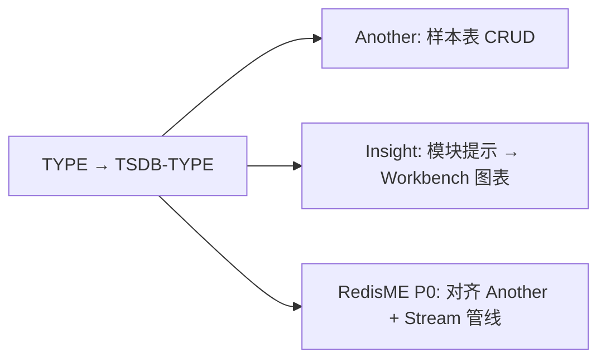
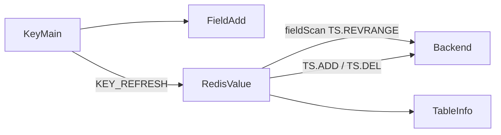

# 30. Redis TimeSeries 类型支持

> **实现状态**：30.1 / 30.2 已实现；30.3 折线图已实现（当前表样本弹框）；其余 P2 待实施  
> **关联 backlog**：`docs/zh/changelog/future.md`（TimeSeries 的支持）  
> **对标实现**：[`18_array-type-support.md`](./18_array-type-support.md)、[`19_vector-set-support.md`](./19_vector-set-support.md)；浏览管线更近 **Stream**（时间范围 + 续页）  
> **竞品核对**：2026-09 源码 / issue（见 §一）；旧表 [`20260718_rdm-competitive-analysis.md`](./20260718_rdm-competitive-analysis.md) §2.5「Tiny/Another 均无 TS」**已过时**（Another 已上）  
> **关键代码（预期）**：`util.rs`、`model.rs`、`client_trait.rs`、`redis_cli_format.rs`；`redis-display.ts`、`RedisValue/*`、`FieldAdd.vue`、`FieldSet.vue`、`helpers.ts`、locales；造数 `zzz/02_seed/TimeSeriesSeed.py`

> 目标：键详情内支持 **TimeSeries**（`TYPE`=`TSDB-TYPE`）样本表的浏览 / 增删改 / Info / 复制命令。P0 **对标 AnotherRDM**；不做 Insight 式 Workbench 图表与多键 `TS.MRANGE` 工作区（可作 P2）。

---

## 一、竞品结论（2026-09）

| 产品                    | 是否支持          | 怎么做                                                                                                      | 对 RedisME 的启示                         |
| ----------------------- | ----------------- | ----------------------------------------------------------------------------------------------------------- | ----------------------------------------- |
| **Another RDM**（最新） | **有**键详情 CRUD | 见 §1.1                                                                                                     | **P0 对标目标**                           |
| **Redis Insight**       | **有**，路径不同  | 见 §1.2                                                                                                     | 图表/多序列是护城河；**P0 不做**，可作 P2 |
| **Tiny RDM**            | **无**            | 仓库无 TS 实现；[issue #499](https://github.com/tiny-craft/tiny-rdm/issues/499)（v1.2.5 / Redis 8.2，open） | 不参考                                    |
| **Redisee**             | 公开资料不明      | Release 几乎无 changelog；官网未强调 TS                                                                     | 暂不跟                                    |
| **patrikx3/redis-ui**   | **无**            | 树无 timeseries；无有效相关 issue                                                                           | 不参考                                    |



### 1.1 Another RDM（键详情一等公民）

上线：[PR #1406](https://github.com/qishibo/AnotherRedisDesktopManager/pull/1406)（2026-08），Release 约 2026-08-15。  
源码：[`KeyContentTimeSeries.vue`](https://github.com/qishibo/AnotherRedisDesktopManager/blob/master/src/components/contents/KeyContentTimeSeries.vue)；路由：[`KeyDetail.vue`](https://github.com/qishibo/AnotherRedisDesktopManager/blob/master/src/components/KeyDetail.vue) 中 `'TSDB-TYPE': 'KeyContentTimeSeries'`；新建：`OperateItem` / `KeyList`。

| 能力                 | 实现                                                                                                |
| -------------------- | --------------------------------------------------------------------------------------------------- |
| 识别                 | `TYPE` → `TSDB-TYPE`                                                                                |
| 浏览                 | `TS.REVRANGE key minTs maxTs [FILTER_BY_VALUE min max] COUNT pageSize`（默认新→旧，`pageSize=200`） |
| 续页                 | 下一页 `maxTs = lastTs - 1`（上一页最小 timestamp − 1）                                             |
| 过滤                 | 工具栏：时间戳区间（`-` / `+`）+ 值区间；Another 几乎总带 `FILTER_BY_VALUE -inf +inf`（一般无害）   |
| 总数                 | `TS.INFO` → `totalSamples`                                                                          |
| 新增                 | `TS.ADD key timestamp value`（默认 timestamp `*`）                                                  |
| 编辑                 | 同 timestamp + `TS.ADD … ON_DUPLICATE LAST`（upsert；时间戳不可改）                                 |
| 删除                 | `TS.DEL key ts ts`（单点区间）                                                                      |
| 新建键               | `TS.ADD key * 0`（不走 `TS.CREATE`，无 retention/labels 表单）                                      |
| Info                 | `TS.INFO` 弹窗（labels / rules 展平为字符串；只读）                                                 |
| 复制命令             | 行 → `TS.ADD key ts value`                                                                          |
| 图表 / 聚合 / 多序列 | **无**（`TS.RANGE`/`TS.CREATE`/`TS.MRANGE` 等未进 UI）                                              |

### 1.2 Redis Insight（Browser 弱 + Workbench 强）

| 层             | 实现                                                                                                                                                                                                                                                   |
| -------------- | ------------------------------------------------------------------------------------------------------------------------------------------------------------------------------------------------------------------------------------------------------ |
| 类型常量       | [`keys.ts`](https://github.com/redis/RedisInsight/blob/main/redisinsight/ui/src/constants/keys.ts)：`ModulesKeyTypes.TimeSeries = 'TSDB-TYPE'`；展示名 `Time Series`（与 Hash/List 等 `KeyTypes` 分开）                                                |
| Browser 键详情 | [`ModulesTypeDetails.tsx`](https://github.com/redis/RedisInsight/blob/main/redisinsight/ui/src/pages/browser/modules/key-details/components/modules-type-details/ModulesTypeDetails.tsx)：标题 + 文案，引导去 **Workbench**；**无** hash/list 式样本表 |
| Workbench 插件 | [`redistimeseries-app`](https://github.com/redis/RedisInsight/tree/main/redisinsight/ui/src/packages/redistimeseries-app)：解析 `TS.RANGE` / `TS.REVRANGE`（单键 datapoints）与 `TS.MRANGE` 等（多键 + labels）→ `ChartResultView` 折线                |

结论：Insight 把 TS 当「模块结果可视化」，不是桌面客户端常见的「打开键 → 表格 CRUD」。RedisME 若只做图表而不做表格，日常运维体验会弱于 Another。

### 1.3 Tiny / 其他

- Tiny：明确未支持（#499），changelog 无 TS。
- Redisee / patrikx3：无可用公开实现可跟。

---

## 二、决策摘要（已钉死）

| 项                  | 结论                                                                                                                                                                                                     |
| ------------------- | -------------------------------------------------------------------------------------------------------------------------------------------------------------------------------------------------------- |
| P0 对标             | AnotherRDM 键详情表，**不做** Insight 图表 / `TS.MRANGE` 多键工作区                                                                                                                                      |
| 能力探测            | **不做**；模块未装时走现有命令错误（与 Array/VectorSet 一致）                                                                                                                                            |
| Tag                 | 简称 **`T`**；展示名 **`TimeSeries`**；颜色 **`danger`**（靠近 Stream）                                                                                                                                  |
| 类型映射            | 仿 JSON：`ui_key_type`：`TSDB-TYPE` → `timeseries`；`to_key_type` 反向；**SCAN TYPE** 在 `scan_1_cmd` 把 `timeseries` 换成 `TSDB-TYPE`（同 `json`→`ReJSON-RL`）；前端 `toKeyTypeLabel` / `KEY_TYPE_LIST` |
| redis-rs            | fork 已有 `ValueType::TimeSeries`（`"TSDB-TYPE"`）；**无** TS.\* 高层 API → 一律 `redis::cmd("TS.…")`；直接 `match ValueType::TimeSeries`（不必 `is_*_type`）                                            |
| 行 IPC              | `{ key: timestamp_str, value: value_str }`（`key`=时间戳，复用表格键列；无 attrs）                                                                                                                       |
| 浏览                | `TS.REVRANGE`（默认同 Another 新→旧）+ `COUNT`；续页用 `FieldScanMeta` 扩 `ts_min` / `ts_max` / `ts_min_value` / `ts_max_value`；游标复用 `stream_cursor` 存上一页最小 timestamp（字符串）               |
| 值过滤              | **有输入才**加 `FILTER_BY_VALUE`（不默认 `-inf`/`+inf`）                                                                                                                                                 |
| 精确                | P0 不做单点精确框；靠时间/值区间过滤                                                                                                                                                                     |
| 写入                | 新建键 / 加样本：`TS.ADD`；改值：同 ts + `ON_DUPLICATE LAST`；删：`TS.DEL from to`                                                                                                                       |
| 长度                | `TS.INFO` → `totalSamples`（解析失败时用页长兜底）                                                                                                                                                       |
| 编码                | timestamp / value 为数值，**不走** wire / 编码管线                                                                                                                                                       |
| 复制命令            | 行 / 键 → `TS.ADD key ts value`（键导出分页上限，对齐 VectorSet）                                                                                                                                        |
| `commandFlags`      | **30.1 起**手工合并全部 `TS.*`（读写标志；对齐 VectorSet 合并 `V*`）；现状仅 `TS.NRANGE`/`NREVRANGE`/`QUERYLABELS`/`READ`                                                                                |
| `KEY_TYPE_TO_GROUP` | `timeseries: 'timeseries'`（cmd 已有 group）                                                                                                                                                             |
| 延后                | 折线图、`TS.CREATE` 全参数 UI（RETENTION / LABELS / 规则）、`TS.MRANGE` / `QUERYINDEX`、聚合 bucket                                                                                                      |

---

## 三、RedisME 现状缺口

- 打开 TS 键落入 [`handle_other_value_type`](../../src-tauri/src/client/client_trait.rs) → `KeyTypeUnsupported`。
- `KEY_TYPE_LIST` / `toKeyTypeLabel` 无 TimeSeries；helpers 的 `supportsTableView` 等未纳入。
- 命令帮助已有完整 `TS.*`（[`locales/cmd`](../../src/locales/cmd/zh-cn.ts)）；配置项已有 `ts-libmr-protocol` 文案。
- 最近似现有模式：**Stream**（时间范围 + 续页游标）+ **ZSet 分数过滤**（工具栏区间）。

---

## 四、类型语义与命令

`TYPE` → `TSDB-TYPE`（模块 RedisTimeSeries；Redis 8+ 常内置）。样本为 `(timestamp_ms, value_f64)`；可有 retention / labels / compaction rules（Info 展示，P0 不编辑）。

| 维度          | 命令 / 行为                                                                  |
| ------------- | ---------------------------------------------------------------------------- |
| 浏览          | `TS.REVRANGE`（P0）/ `TS.RANGE`（P1 正序）+ `COUNT` + 可选 `FILTER_BY_VALUE` |
| 写入          | `TS.ADD`；编辑加 `ON_DUPLICATE LAST`                                         |
| 删除          | `TS.DEL key from_ts to_ts`                                                   |
| 长度 / 元数据 | `TS.INFO` → `totalSamples` 等                                                |
| 新建键        | `TS.ADD key * 0`（对齐 Another；空键也可用 `TS.CREATE`，P0 不跟全参数）      |



### 4.1 阶段归属

| 命令 / 能力                                                                       | 阶段        |
| --------------------------------------------------------------------------------- | ----------- |
| TS.ADD / TS.DEL / TS.REVRANGE + COUNT / FILTER_BY_VALUE / length(INFO) / 复制命令 | 30.1        |
| TS.INFO 弹窗；TS.RANGE / REVRANGE 切换                                            | 30.2        |
| 简易折线；TS.CREATE 选项；QUERYINDEX                                              | 30.3 / 延后 |
| TS.MRANGE / 聚合 AGGREGATION / CREATERULE UI                                      | 延后        |

---

## 五、浏览契约（对齐 Another + Stream 游标）

```text
TS.REVRANGE key fromTimestamp toTimestamp
  [FILTER_BY_VALUE min max]
  COUNT count
```

1. 首页：`from = ts_min || "-"`，`to = ts_max || "+"`，`stream_cursor=""`；`COUNT=batch`
2. 续页：`to = stream_cursor 解析出的上一页最小 ts − 1`（字符串减一，注意大整数）；`from` 仍用工具栏下限
3. `本页条数 < count` → `finished`
4. 值过滤：工具栏 **有输入才**追加 `FILTER_BY_VALUE`（见决策表）
5. 行模型：`{ key: timestamp_str, value: value_str }`（见决策表）

**禁止**一次 `TS.RANGE - +` 无 COUNT 全量进内存。

---

## 六、分阶段验收与提交

每阶段：**实现 → 手工验收 → 单独 commit**（一行标题，无 body）。完成后勾 `future.md`。

### 30.1 P0 — 基础读写（对标 Another）

**做：**

- 后端：`ValueType::TimeSeries` 接入 `field_scan` / `field_add` / `field_set` / `field_del` / length / `get_*_as_command`；`ui_key_type` / `to_key_type`；`scan_1_cmd` 的 `timeseries`→`TSDB-TYPE`；`FieldScanMeta` 扩 TS 区间字段
- 前端：`KEY_TYPE_LIST`；`RedisValue` 表列 timestamp / 可读时间 / value；工具栏区间；`FieldAdd` 新建（`TS.ADD * 0` 或首样本）；编辑 / 删行；i18n；`supportsTableView` 等；`exportRows` 与列同步
- `locales/cmd/index.ts`：补全全部 `TS.*` 的 `commandFlags`（只读终端否则可能误拦 `TS.RANGE` 等）

**验收：**

- 有 RedisTimeSeries 的实例：新建、浏览续页、改/删、复制命令；键列表按类型筛 `TimeSeries` 可用
- 无模块：报错可理解
- 键列表 Tag 显示 `T`（danger）
- 只读终端可执行 `TS.RANGE` / `TS.INFO` 等读命令

### 30.2 P1 — Info + 正序

- `TS.INFO` 弹窗（复用 [`TableInfo.vue`](../../src/views/tab/RedisValue/TableInfo.vue)）
- `TS.RANGE` / `REVRANGE` 切换（对标 Stream 正倒序）

### 30.3 P2 — 可选增强

- 简易折线（可参考 Insight `redistimeseries-app` 的 datapoints 形状，但挂在键详情而非 Workbench）
- `TS.CREATE` 选项（RETENTION / DUPLICATE_POLICY / LABELS）
- 按 label 的 `QUERYINDEX` **不进**首期键详情

---

## 七、改动清单（汇总）

### 后端

1. [`util.rs`](../../src-tauri/src/utils/util.rs)：常量 + `TSDB-TYPE` ↔ `timeseries`（仿 `ReJSON-RL` / `ME_JSON_TYPE_NAME`）
2. [`client_trait.rs`](../../src-tauri/src/client/client_trait.rs) `scan_1_cmd`：`timeseries` → `TSDB-TYPE`
3. [`model.rs`](../../src-tauri/src/utils/model.rs)：`FieldScanMeta` 增加 `ts_min` / `ts_max` / `ts_min_value` / `ts_max_value`（及 30.2 的 `ts_desc`）
4. [`client_trait.rs`](../../src-tauri/src/client/client_trait.rs)：`field_*` / length / 复制命令分支
5. `redis_cli_format`：`TS.ADD` 行格式化
6. Specta 同步前端类型

### 前端

1. [`redis-display.ts`](../../src/utils/redis-display.ts)：`KEY_TYPE_LIST` + `toKeyTypeLabel`（`tsdb-type`→`TimeSeries`）
2. [`RedisValue/index.vue`](../../src/views/tab/RedisValue/index.vue) + helpers：类型分支、工具栏、表格列、`exportRows`
3. `FieldAdd` / `FieldSet`：timestamp + number value（无编码切换）
4. i18n；`KEY_TYPE_TO_GROUP`
5. [`locales/cmd/index.ts`](../../src/locales/cmd/index.ts)：全部 `TS.*` flags

---

## 八、风险与注意

- 大序列务必 `COUNT` 分页；键导出设上限（对齐 VectorSet 千级）。
- timestamp 用**字符串**进 IPC，避免 JS `Number` 大整数精度问题；续页 `lastTs - 1` 用大整数安全减法（字符串或 BigInt）。
- 改样本语义是 **upsert**（`ON_DUPLICATE LAST`），不是 Stream 式不可变 ID。
- 重复策略若为 `BLOCK`，编辑可能失败——错误透传即可，P0 不改键级 policy。
- 升级 redis-rs 时确认 `ValueType::TimeSeries` 仍映射 `TSDB-TYPE`。

---

## 九、参考链接

- RedisTimeSeries 命令：https://redis.io/docs/latest/commands/?group=timeseries
- Another PR：https://github.com/qishibo/AnotherRedisDesktopManager/pull/1406
- Another：`KeyContentTimeSeries.vue`（上文）
- Insight Browser：`ModulesTypeDetails` + `ModulesKeyTypes.TimeSeries`
- Insight 图表插件：`redisinsight/ui/src/packages/redistimeseries-app`
- Tiny 缺口：https://github.com/tiny-craft/tiny-rdm/issues/499
